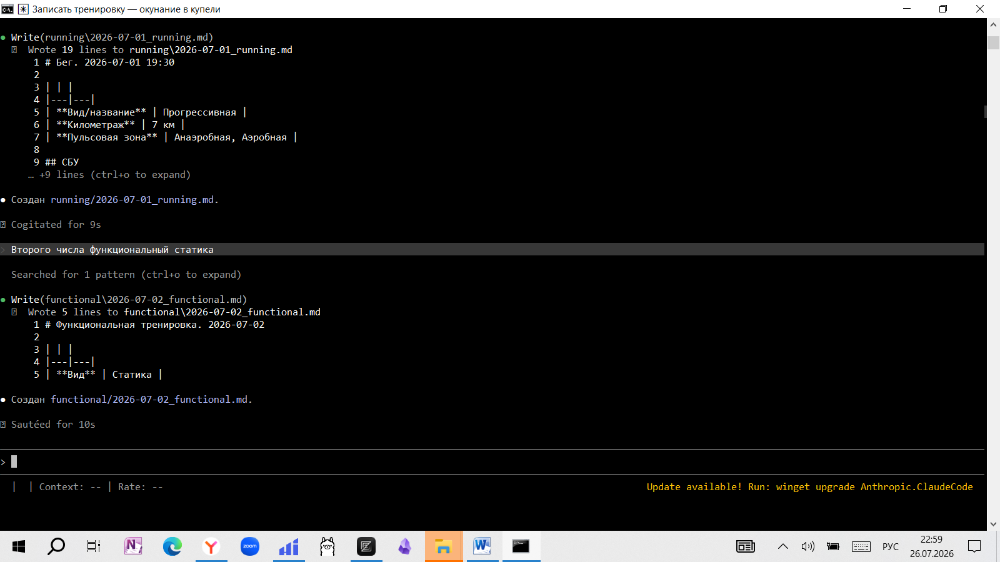
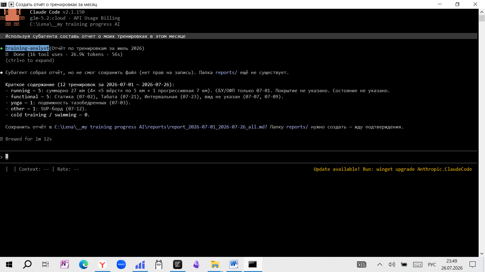
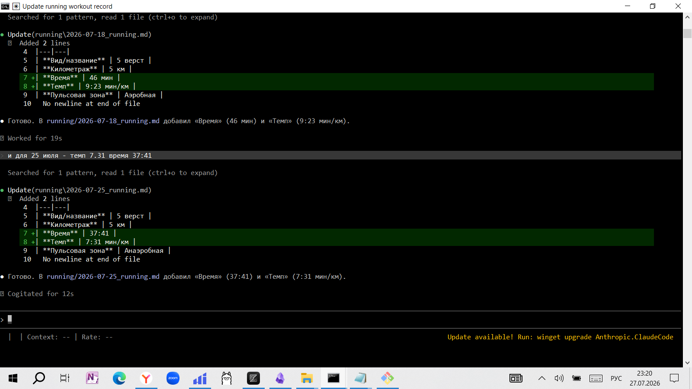
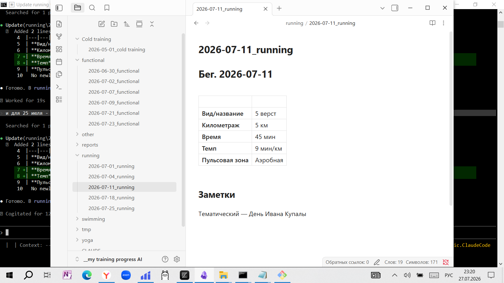
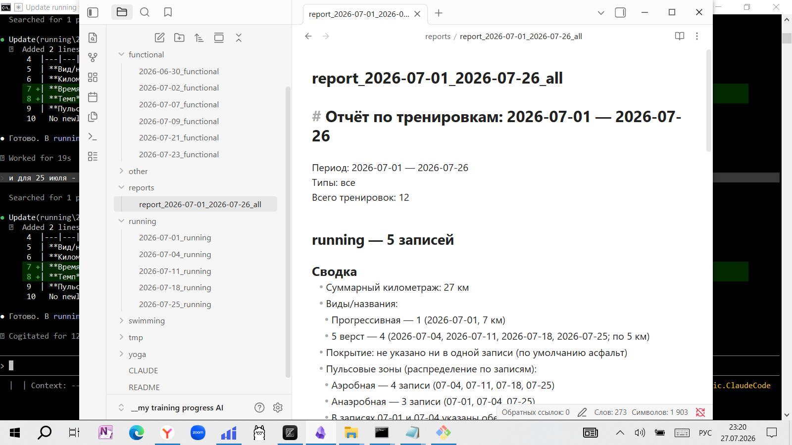

# Журнал тренировок в Obsidian с AI-ассистентом

Личный журнал тренировок в Obsidian-vault с ассистентом на Claude Code. Структурированная фиксация тренировок разных направлений, поиск по записям и сводки по периодам.

## Проблема

Тренировки нескольких направлений (холодовые, функциональные, бег, йога, плавание) нужно фиксировать регулярно и единообразно, чтобы со временем видеть прогресс и состояние. Без структуры записи получаются разрозненными, сравнивать периоды сложно. Прогресс в тренировках измеряется не одной сессией, а серией — нужна упорядоченная история.

## Пользователь

Тренирующийся, ведущий личный журнал в Obsidian. Знает терминологию (СБУ/ОФП, HR zones, табата/круговая/интервальная/статика, трейл/асфальт), фиксирует и агрегирует записи без обучения базе.

## Основная функция

- **Вход:** словесное описание тренировки (тип, дата, содержание, объём, параметры, состояние).
- **Выход:** структурированная markdown-заметка в папке соответствующего типа с именем `YYYY-MM-DD_<тип>.md`.
- **Инструменты:** Obsidian-vault как хранилище; markdown-файлы с YAML frontmatter; skills Claude Code для преобразования описания в заметку по типам (`cold-training-note`, `functional-note`, `running-note`, `swimming-note`, `yoga-note`).

## Формат результата

Готовая заметка в vault. По запросу — сводка по периоду или направлению в виде markdown с агрегацией по фактически записанным данным (без оценок, которых не просили).

## Структура vault

```
.
├── Cold training/    # холодовой тренинг (зимнее плавание и аналоги)
├── functional/       # функциональные тренировки (табата/круговая/интервальная/статика/др.)
├── running/          # бег, включая блоки СБУ и ОФП
├── yoga/             # йога
├── swimming/         # плавание
├── other/            # прочие направления
├── reports/          # сводные отчёты по периодам
└── CLAUDE.md         # инструкции ассистенту
```

## Имя файла

`YYYY-MM-DD_<тип>.md`, например `2026-07-25_running.md`.

Если в один день несколько тренировок одного типа — добавляется суффикс: `2026-07-25_running-2.md`.

## Шаблон записи

Поля заполняются **только те, что названы** — остальные остаются пустыми.

- Дата / время
- Тип тренировки
- Вид тренировки (для functional — табата/круговая/интервальная/статика/др.; для running — покрытие: асфальт по умолчанию или трейл)
- Содержание (для running — отдельные блоки СБУ и/или ОФП, если были)
- Объём и интенсивность (для running: темп, километраж, зоны пульса и т.д.)
- Субъективное состояние
- Заметки

## Минимальный функционал (MVP)

- Папки по типам тренировок (`cold training/`, `functional/`, `running/`, `yoga/`, `swimming/`, `other/`).
- Шаблон записи с полями «только то, что названо» — пустые поля остаются пустыми.
- Skills для каждого типа тренировки.
- Поиск записей по дате, типу, параметру; сводки по периоду.

## Планируется добавить

- Кастомные инструменты и субагенты для аналитики прогресса.
- Автоматические отчёты по периодам.

## Принципы работы ассистента

- Фиксировать только то, что названо пользователем. Не добавлять параметры, цифры, оценки.
- Пустые поля оставлять пустыми.
- Если данных не хватает для минимальной записи — задать уточняющий вопрос.
- Перед значимыми действиями (создание папки, шаблона, переименование файла) — показывать план и ждать подтверждения.
- Не удалять и не переименовывать файлы без явного разрешения.
- Не выходить за пределы рабочей директории проекта.

## Технологии

- **Формат:** markdown-файлы в Obsidian-vault, YAML frontmatter.
- **Ассистент:** Claude Code со skills (markdown-шаблоны).
- **Явного кода на данный момент нет** — структура vault и skills.

## Лицензия

Личный проект, публикуется как есть.

(images/Агент записывает 1.png)





